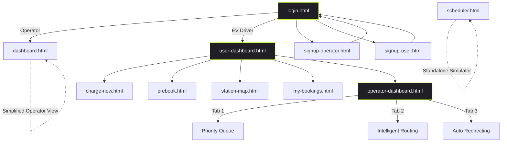

# GridPulz — Frontend Documentation

> Comprehensive page-by-page documentation of the GridPulz EV Charging Management Platform.

---

## Table of Contents

1. [Architecture Overview](#architecture-overview)
2. [Authentication Pages](#authentication-pages)
3. [EV Driver Pages](#ev-driver-pages)
4. [Operator Pages](#operator-pages)
5. [JavaScript Modules](#javascript-modules)
6. [Navigation Map](#navigation-map)

---

## Architecture Overview

GridPulz is a **multi-role EV charging management platform** built as a static HTML/JS frontend connected to a **Supabase** backend. It serves two user roles:

| Role | Purpose | Entry Point |
|------|---------|-------------|
| **Station Operator** | Register and monitor charging stations | [signup-operator.html](file:///Users/allen/Desktop/frontend/signup-operator.html) → [dashboard.html](file:///Users/allen/Desktop/frontend/dashboard.html) |
| **EV Driver** | Find stations, book slots, track battery | [signup-user.html](file:///Users/allen/Desktop/frontend/signup-user.html) → [user-dashboard.html](file:///Users/allen/Desktop/frontend/user-dashboard.html) |

**Tech Stack:**
- **Frontend:** HTML5, TailwindCSS (CDN), Vanilla JavaScript
- **Maps:** Leaflet.js (v1.9.4) with OpenStreetMap tiles
- **Backend:** Supabase (Auth + PostgreSQL + Realtime)
- **Charts:** Chart.js (operator dashboard only)
- **Design:** Dark-mode glassmorphism with neon-green (`#BFFF00`) accent

---

## Authentication Pages

### 1. Login Page — [login.html](file:///Users/allen/Desktop/frontend/login.html)

**Purpose:** Unified authentication gateway for both Station Operators and EV Drivers.

**UI Layout:**
- Centered glassmorphic card with dot-grid animated background
- GridPulz logo at top
- **Role toggle tabs** at the top of the form: "Station Operator" vs "EV Driver"
- Email/phone input field and password field
- "Authenticate" submit button
- Links to both registration pages at the bottom

**Functionality:**
- [switchRole(role)](file:///Users/allen/Desktop/frontend/login.html#124-140) — Toggles the active tab UI between `operator` and `user`, storing the selection in `window.currentRole`
- [handleLogin(event)](file:///Users/allen/Desktop/frontend/js/auth.js#134-163) *(from [auth.js](file:///Users/allen/Desktop/frontend/js/auth.js))* — Authenticates via `supabaseClient.auth.signInWithPassword()`. On success, reads `user_metadata.role` to determine routing:
  - **Operator** → redirects to [dashboard.html](file:///Users/allen/Desktop/frontend/dashboard.html)
  - **EV Driver** → redirects to [user-dashboard.html](file:///Users/allen/Desktop/frontend/user-dashboard.html)

**Dependencies:** [supabase-config.js](file:///Users/allen/Desktop/frontend/js/supabase-config.js), [auth.js](file:///Users/allen/Desktop/frontend/js/auth.js)

---

### 2. EV Driver Registration — [signup-user.html](file:///Users/allen/Desktop/frontend/signup-user.html)

**Purpose:** Registers a new EV driver account with personal info and vehicle parameters.

**UI Layout:**
- Two-column glassmorphic form:
  - **Left column — Identity:** Full Name, Email, Phone, Password
  - **Right column — Vehicle Parameters:** Vehicle Type (2W/3W/4W/Bus), Battery Capacity (kWh), Preferred Charging Type (Fast DC / Normal AC / Any), Charging Preferences (free text)
- "Create Identity" submit button
- Link to login page at bottom

**Functionality:**
- [handleUserSignup(event)](file:///Users/allen/Desktop/frontend/js/auth.js#164-234) *(from [auth.js](file:///Users/allen/Desktop/frontend/js/auth.js))* —
  1. Creates Supabase Auth user with `role: 'user'` in metadata
  2. Immediately signs in to obtain an authenticated session
  3. Inserts a row into the `users` table with vehicle profile data
  4. Redirects to [login.html](file:///Users/allen/Desktop/frontend/login.html) on success

**Dependencies:** [supabase-config.js](file:///Users/allen/Desktop/frontend/js/supabase-config.js), [auth.js](file:///Users/allen/Desktop/frontend/js/auth.js)

---

### 3. Station Operator Registration — [signup-operator.html](file:///Users/allen/Desktop/frontend/signup-operator.html)

**Purpose:** Registers a new charging station operator with station infrastructure details.

**UI Layout:**
- Two-column glassmorphic form:
  - **Left column — Operator Identity:** Company/Station Name, Admin Email, Password, Contact Phone, Station Email, Address, Latitude/Longitude (auto-detected via GPS)
  - **Right column — Grid Parameters:** Total Charging Points, Charging Type (AC/DC), Connector Type (CCS/CHAdeMO/Type 2/Mixed), Total Capacity (kV), Voltage, Max Current, Meter Available (Yes/No), Communication Type (e.g. MQTT), Operating Hours, Average Usage
- "Establish Node" submit button
- Geolocation auto-fill for lat/lng on page load

**Functionality:**
- [handleOperatorSignup(event)](file:///Users/allen/Desktop/frontend/js/auth.js#15-133) *(from [auth.js](file:///Users/allen/Desktop/frontend/js/auth.js))* —
  1. Creates Supabase Auth user with `role: 'operator'` in metadata
  2. Signs in immediately for authenticated session
  3. Inserts station data into the `stations` table, trying multiple payload variants to handle different schema column names
  4. Redirects to [login.html](file:///Users/allen/Desktop/frontend/login.html) on success
- **Auto GPS detection** via `navigator.geolocation.getCurrentPosition()` fills lat/lng fields

**Dependencies:** [supabase-config.js](file:///Users/allen/Desktop/frontend/js/supabase-config.js), [auth.js](file:///Users/allen/Desktop/frontend/js/auth.js)

---

## EV Driver Pages

### 4. EV Driver Dashboard — [user-dashboard.html](file:///Users/allen/Desktop/frontend/user-dashboard.html)

**Purpose:** Central hub for EV drivers after login. Shows vehicle profile and provides navigation to all driver features.

**UI Layout:**
- **Sidebar (260px):** Logo, driver name/email, navigation links (Dashboard, My Bookings, Settings, Operator Dash), Logout button
- **Main Content:**
  - **"My Vehicle" card** — Displays vehicle name, battery capacity (kWh), charging type, and email. Includes **Edit/Save** buttons to toggle inline editing of vehicle fields
  - **Action Hub** — Three large action cards:
    1. **Charge Now** → links to [charge-now.html](file:///Users/allen/Desktop/frontend/charge-now.html)
    2. **Prebook Slot** → links to [prebook.html](file:///Users/allen/Desktop/frontend/prebook.html)
    3. **Station Map** → links to [station-map.html](file:///Users/allen/Desktop/frontend/station-map.html)

**Functionality:**
- Fetches authenticated user profile from Supabase on load
- Populates sidebar with driver name and email
- Edit mode toggles between view spans and input fields for vehicle profile
- Save persists updated profile to Supabase `users` table
- Toast notification system for success/error feedback

**Dependencies:** [supabase-config.js](file:///Users/allen/Desktop/frontend/js/supabase-config.js), [database.js](file:///Users/allen/Desktop/frontend/js/database.js), [stations-realtime.js](file:///Users/allen/Desktop/frontend/js/stations-realtime.js), [dashboard.js](file:///Users/allen/Desktop/frontend/js/dashboard.js)

---

### 5. Charge Now — [charge-now.html](file:///Users/allen/Desktop/frontend/charge-now.html)

**Purpose:** Immediate charging slot allocation based on current battery SoC and GPS location.

**UI Layout:**
- Back arrow to [user-dashboard.html](file:///Users/allen/Desktop/frontend/user-dashboard.html)
- **Left panel (2/5 width):**
  - **SoC slider** (0–100%) with color-coded gradient track (red → yellow → green)
  - **GPS location display** with manual "GPS" refresh button
  - **"Request Charging Slot"** button
- **Right panel (3/5 width):**
  - **Live Leaflet map** with dark theme, showing nearby stations as color-coded markers
  - Realtime connection status badge (top-right)
- **Reroute alert banner** (hidden by default) — Appears when grid safeguard triggers a redirect
- **Booking result card** (hidden by default) — Shows confirmation after successful allocation
- **Confirm Booking Modal** — Popup to confirm the slot request before submission

**Functionality:**
- SoC slider updates the display value in real time
- GPS button triggers `navigator.geolocation.getCurrentPosition()` to update coordinates
- Map initializes via Leaflet, centered on user's GPS, with station markers fetched from Supabase
- "Request Charging Slot" opens confirmation modal → on confirm, runs priority-based allocation via [dashboard.js](file:///Users/allen/Desktop/frontend/js/dashboard.js)
- Grid safeguard system can dynamically redirect to an alternate station if the target is overloaded

**Dependencies:** [supabase-config.js](file:///Users/allen/Desktop/frontend/js/supabase-config.js), [database.js](file:///Users/allen/Desktop/frontend/js/database.js), [stations-realtime.js](file:///Users/allen/Desktop/frontend/js/stations-realtime.js), [dashboard.js](file:///Users/allen/Desktop/frontend/js/dashboard.js), Leaflet.js

---

### 6. Prebook Slot — [prebook.html](file:///Users/allen/Desktop/frontend/prebook.html)

**Purpose:** Schedule a future charging session at a specific date and time.

**UI Layout:**
- Back arrow to [user-dashboard.html](file:///Users/allen/Desktop/frontend/user-dashboard.html)
- **Left panel — Schedule Booking form:**
  - Battery at Target Time (%) — number input
  - Date picker
  - Time picker
  - "Confirm Prebooking" submit button
- **Right panel — Upcoming Bookings list:**
  - Displays all scheduled prebookings with station name, date/time
  - Empty state placeholder when no bookings exist
- **Confirm Prebook Modal** — Confirmation popup before finalizing the reservation

**Functionality:**
- Form validates required fields (SoC, date, time)
- On submission, creates a prebooking record in Supabase with temporal constraint data
- Upcoming bookings list fetches and renders from the database
- Prebooking integrates with the scheduler's temporal weight system (`Wt` factor)

**Dependencies:** [supabase-config.js](file:///Users/allen/Desktop/frontend/js/supabase-config.js), [database.js](file:///Users/allen/Desktop/frontend/js/database.js), [stations-realtime.js](file:///Users/allen/Desktop/frontend/js/stations-realtime.js), [dashboard.js](file:///Users/allen/Desktop/frontend/js/dashboard.js), Leaflet.js

---

### 7. Station Map — [station-map.html](file:///Users/allen/Desktop/frontend/station-map.html)

**Purpose:** Full-screen interactive map showing all nearby charging stations with real-time grid health.

**UI Layout:**
- Back arrow to [user-dashboard.html](file:///Users/allen/Desktop/frontend/user-dashboard.html)
- **Metrics row (3 cards):**
  - Next Live Sync countdown timer (seconds)
  - Stations in Radius (count)
  - Cluster Mode / Zoom level indicator
- **Map panel:**
  - Color-coded legend: 🟢 Low load, 🟡 Moderate, 🔴 Overloaded
  - **Toggle Zoom** button — switches between zoomed-in and zoomed-out views
  - **Force Sync** button — manually refreshes station data from Supabase
  - **Loading overlay** with spinner and status text during initialization
  - **Leaflet map container** (450px height) with dark theme

**Functionality:**
- On load, requests user geolocation and initializes Leaflet map centered on GPS coordinates
- Fetches stations from Supabase via [getNearbyStations()](file:///Users/allen/Desktop/frontend/js/database.js#48-73) from [database.js](file:///Users/allen/Desktop/frontend/js/database.js)
- Renders stations as circle markers, color-coded by grid load:
  - **Green** (≤55% load) — Healthy
  - **Amber** (55–75% load) — Moderate
  - **Red** (>75% load) — Overloaded
- Popups on markers show station name, distance, available slots, and grid load %
- Auto-refresh with countdown timer; force-sync bypasses timer
- Realtime subscription via [stations-realtime.js](file:///Users/allen/Desktop/frontend/js/stations-realtime.js) updates markers live when station data changes

**Dependencies:** [supabase-config.js](file:///Users/allen/Desktop/frontend/js/supabase-config.js), [database.js](file:///Users/allen/Desktop/frontend/js/database.js), [stations-realtime.js](file:///Users/allen/Desktop/frontend/js/stations-realtime.js), [dashboard.js](file:///Users/allen/Desktop/frontend/js/dashboard.js), Leaflet.js

---

### 8. My Bookings — [my-bookings.html](file:///Users/allen/Desktop/frontend/my-bookings.html)

**Purpose:** View and manage all active and upcoming charging reservations.

**UI Layout:**
- Back arrow to [user-dashboard.html](file:///Users/allen/Desktop/frontend/user-dashboard.html)
- **Two-column grid:**
  - **Left — Active Queue:** Lists currently active "Charge Now" requests with status, station assignment, and position in queue
  - **Right — Scheduled Prebookings:** Lists all future pre-booked charging slots with date, time, station, and SoC target
- Empty state placeholders for both columns

**Functionality:**
- Fetches bookings for the authenticated user from Supabase on page load
- Active bookings show real-time queue status
- Prebookings display scheduled slot details
- Cancel/modify actions available on booking cards

**Dependencies:** [supabase-config.js](file:///Users/allen/Desktop/frontend/js/supabase-config.js), [database.js](file:///Users/allen/Desktop/frontend/js/database.js), [stations-realtime.js](file:///Users/allen/Desktop/frontend/js/stations-realtime.js), [dashboard.js](file:///Users/allen/Desktop/frontend/js/dashboard.js), Leaflet.js

---

## Operator Pages

### 9. Operator Command Center — [dashboard.html](file:///Users/allen/Desktop/frontend/dashboard.html)

**Purpose:** Simplified operator dashboard showing live station telemetry with ML-predicted load.

**UI Layout:**
- **Sidebar (260px):** GridPulz brand, station name display, nav links (Command Center, Logout)
- **Main Content:**
  - **Metrics row (3 cards):**
    1. **Current Load** — real-time kW with max capacity
    2. **ML Predicted Load (15m)** — XGBoost forecast with alert banner on high prediction
    3. **Active EV Sessions** — count with total plug capacity
  - **Live Load Stream** — Chart.js real-time line chart graphing load over time

**Functionality:**
- Loads station data associated with the logged-in operator from Supabase
- Populates sidebar station name and metric cards
- Chart.js renders a real-time streaming chart of load data
- ML alert banner appears when predicted load exceeds threshold
- Responsive layout collapses to single-column on mobile

**Dependencies:** [supabase-config.js](file:///Users/allen/Desktop/frontend/js/supabase-config.js), [operator.js](file:///Users/allen/Desktop/frontend/js/operator.js), Chart.js

---

### 10. Grid Operator Dashboard — [operator-dashboard.html](file:///Users/allen/Desktop/frontend/operator-dashboard.html)

**Purpose:** Advanced multi-module operator interface combining Priority Scheduling, Intelligent Routing, and Automated Redirecting.

**UI Layout:**
- **Sidebar (260px):** Logo, nav (Operator Dash active), live clock
- **Tab Navigation:** Three tabs switching between modules
- **Main Content (3 tabs):**

#### Tab 1: Priority Queue
- **Metrics bar:** Vehicles Queued, Available Slots, Allocations Made
- **Three-column layout:**
  - **Left — Charging Network:** Station cards showing slot availability and grid load
  - **Left — Add to Queue form:** Driver Name, Battery SoC slider, Target Station selector, Pre-book Time input, "Enqueue Vehicle" button
  - **Middle — Live Queue:** Priority-ordered list of vehicles with **Run Target** and **Reset** buttons
  - **Right — Allocation Log:** Decision history showing which vehicles were assigned to which slots

#### Tab 2: Intelligent Routing
- **SoC-Adaptive routing demo** with interactive controls:
  - Battery SoC slider (2–95%)
  - Routing Mode selector: Auto (SoC-adaptive), Emergency (<15% override), Eco (grid-first)
- **Dynamic weight display:** W₁ (Distance), W₂ (Grid Risk), W₃ (Wait Time)
- **Ranked station table** — Stations scored and sorted using weighted Haversine + SoC formula
- Emergency alert banner when SoC < 15%

#### Tab 3: Auto Redirecting
- **Trigger Simulator** with three conflict scenario buttons:
  1. ML: High-Risk Surge (XGBoost prediction)
  2. Slots Drop to 0 (capacity exhaustion)
  3. Priority Conflict (5% vs 60% SoC)
- **Alert area** — Displays context-specific warning/danger messages
- **Live Token Transfer visualization:** Station Alpha ↔ Station Beta with animated status transitions, priority token transfer animation, and route recalculation progress bar

**Functionality:**

*Priority Queue (Tab 1):*
- Adds vehicles to a priority queue sorted by scoring formula: `score = (100 - bat%) × 0.6 + waitMins × 0.3 - gridLoad% × 0.1 + Wt`
- "Run Target" allocates the highest-priority vehicle to an available slot
- Algorithm trace panel highlights each step of the allocation process
- Decision log records all allocations

*Intelligent Routing (Tab 2):*
- [getWeights(soc, mode)](file:///Users/allen/Desktop/frontend/operator-dashboard.html#434-440) dynamically adjusts three routing weights based on battery level and mode
- [updateRouting()](file:///Users/allen/Desktop/frontend/operator-dashboard.html#441-493) calculates composite scores for all stations and renders a ranked table
- Emergency mode (SoC < 15%) forces distance weight to 0.80 for closest-station routing

*Auto Redirecting (Tab 3):*
- [fireTrigger(i)](file:///Users/allen/Desktop/frontend/operator-dashboard.html#504-552) simulates conflict conditions and animates the redirect workflow
- Visual token transfer from Station Alpha to Station Beta with status badge transitions
- Progress bar shows reroute recalculation completion
- [resetTriggers()](file:///Users/allen/Desktop/frontend/operator-dashboard.html#553-585) restores default nominal state

**Dependencies:** [scheduler.js](file:///Users/allen/Desktop/frontend/js/scheduler.js) (loaded separately)

---

### 11. Priority Scheduler (Standalone) — [scheduler.html](file:///Users/allen/Desktop/frontend/scheduler.html)

**Purpose:** Standalone priority scheduling simulator for network admin testing, separate from the operator dashboard.

**UI Layout:**
- **Header bar:** Logo, title "Priority Scheduler · Network Admin · Simulator", metric pills (Vehicles Queued, Available Slots, Allocs Made)
- **Three-column grid:**
  - **Left — Charging Network + Add Vehicle form** (same as operator-dashboard Tab 1)
  - **Middle — Priority Queue + Score Formula** with explicit formula breakdown showing weight components
  - **Right — Allocation Log + Algorithm Logic Trace** with 8-step trace panel

**Functionality:**
- Identical scheduling logic to operator-dashboard Tab 1 but as a dedicated page
- Score formula clearly displayed: `score = (100 - bat%) × 0.6 + waitMins × 0.3 - gridLoad% × 0.1 + Wt`
- Algorithm trace highlights each step as it executes
- No Supabase dependency — runs entirely client-side as a simulation

**Dependencies:** [scheduler.js](file:///Users/allen/Desktop/frontend/js/scheduler.js)

---

## JavaScript Modules

| Module | File | Purpose |
|--------|------|---------|
| **Supabase Config** | [supabase-config.js](file:///Users/allen/Desktop/frontend/js/supabase-config.js) | Initializes the Supabase client with project URL and anon key. Exposes `window.supabaseClient`. |
| **Authentication** | [auth.js](file:///Users/allen/Desktop/frontend/js/auth.js) | Handles login ([handleLogin](file:///Users/allen/Desktop/frontend/js/auth.js#134-163)), user signup ([handleUserSignup](file:///Users/allen/Desktop/frontend/js/auth.js#164-234)), and operator signup ([handleOperatorSignup](file:///Users/allen/Desktop/frontend/js/auth.js#15-133)). Manages role-based routing after auth. |
| **Database Utilities** | [database.js](file:///Users/allen/Desktop/frontend/js/database.js) | Provides [haversineKm()](file:///Users/allen/Desktop/frontend/js/database.js#5-18) for GPS distance calculation, [insertLiveData()](file:///Users/allen/Desktop/frontend/js/database.js#19-47) for SoC/location sync, [getNearbyStations()](file:///Users/allen/Desktop/frontend/js/database.js#48-73) for radius-filtered station discovery, and [getAllStationsCached()](file:///Users/allen/Desktop/frontend/js/database.js#79-93) for cached station retrieval. |
| **Realtime Stations** | [stations-realtime.js](file:///Users/allen/Desktop/frontend/js/stations-realtime.js) | Subscribes to Supabase Realtime for live station data changes. Updates cached station data and map markers in real time. |
| **Dashboard Logic** | [dashboard.js](file:///Users/allen/Desktop/frontend/js/dashboard.js) | Core EV driver logic: profile loading, SoC slider, GPS integration, map initialization, Charge Now allocation, prebooking, booking list rendering, toast notifications, and grid safeguard redirect system. |
| **Operator Logic** | [operator.js](file:///Users/allen/Desktop/frontend/js/operator.js) | Operator command center logic: station data loading, metrics rendering, Chart.js live load stream, and ML prediction alert system. |
| **Scheduler** | [scheduler.js](file:///Users/allen/Desktop/frontend/js/scheduler.js) | Priority queue engine: vehicle enqueue, priority score calculation, slot allocation algorithm, station rendering, decision logging, and algorithm trace animation. |

---

## Navigation Map

---

*Generated for the GridPulz EV Charging Platform — April 2026*
